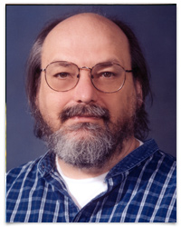
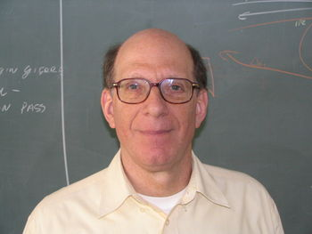
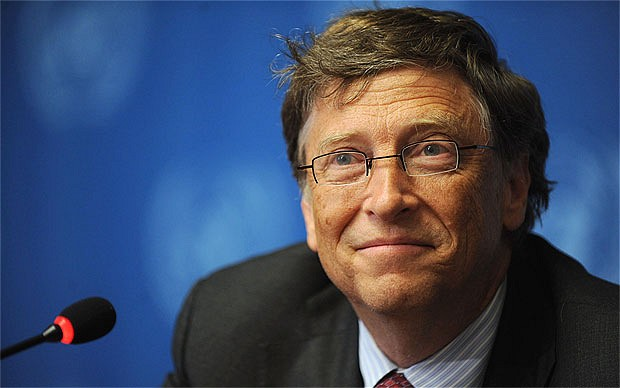
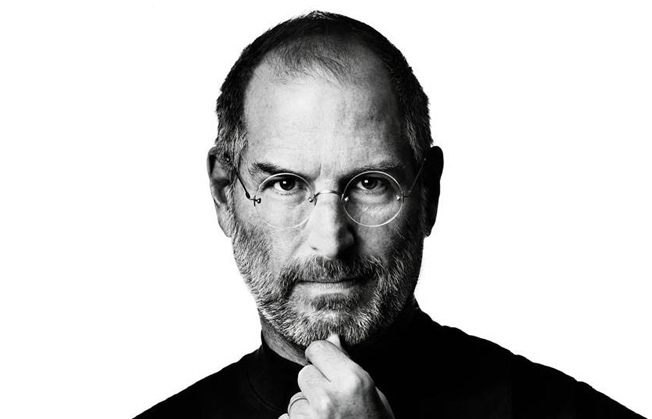

#   Üstadlar

.fx: first

Alaattin `<alaattin.usta@bil.omu.edu.tr>`

http://austa.github.io/fo/

Aralık 2013

---

##  Dennis Ritchie

---

##  Dennis Ritchie

- C ve Unix yaratıcısı
- Yazılım dünyasının en önemli bilimcisi
- 1983’te Turing Ödülü
- 1999’de Ulusal Teknoloji Madalyası ödülü
- 12 Ekim 2011'de hayatını kaybetti
- printf("Goodbye World");

---

##  Ken Thompson

---

##  Ken Thompson

- Unix işletim sistemi
- B programlama dilini yaratıcısı
- Plan-9 işletim sistemini tasarladı
- Utf-8 karakter sınıflandırması

---

##  Ken Thompson

- Turing Ödülü
- UC Berkeley mezunu
- Unix editörü ED'i geliştirdi

---

## Linus Torvalds

---

##  Linus Torvalds

- Finlandiya asıllı Amerikalı mühendis
- Linux işletim sistemi geliştiricisi
- Minix işletim sistemini aldı ve geliştirdi
- Tanenbaum'la arası bozuldu
- Minix işletim sistemi ile Linux geliştirdi

---

##  Linus Torvalds

- İlk kodu 12 yaşında yazdı
- 22 yaşında Linux kodlamak
- Minix zarar gördükten sonra Linux'la devam etti
- OSDL(Açık Kaynak Geliştirme Laboratuvarı)

---
##  Andrew S.Tanenbaum

---

##  Andrew S.Tanenbaum

- Minix işletim sistemi
- Amoeba işletim sistemi
- Linus Torvalds ile tartışma yapmıştır
- İşletim sistemleri ve Bilgisayar Ağları üzerine kitaplar yazmış
- Dağınık Sistemler de ilgi alanı
- Halen Vrije Universite'sinde çalışıyor

---

##  Bill Gates

---

##  Bill Gates

- Dünyanın en zangin iş adamı
- Microsoft sahibi
- Çocukluğunu bilgisayarla geçirmiş
- 1955 doğumlu, 1972 ilk şirket
- Microsoft 1993 yılında yılda 36 milyar$ ciro

---

##  Steve Jobs

---

##  Steve Jobs

- Dünya'yı değiştiren 3 elmadan biri!
- Next Computer ve Pixar Animasyon
- Garajda sistem kurmak
- Her zaman tasarımın önemini vurgular
- Tam bir mükemmelliyetçi
- Kendi kurduğu şirkettten kovuldu

---

##  Steve Jobs

- Apple'da aylık 1$'dan bir kaç yıl çalıştı
- Guiness Dünya Rekorları en düşük maaşlı CEO
- Resmi olarak hala maaşı 1$
- Mükemmel ikna etme ve pazarlamacılık
- Cook -"Apple vizyon sahibi bir kişiyi; dünya inanılmaz bir insanı kaybetti"

---

##  Rasmus Lerdorf

---

##  Rasmus Lerdorf

- Pek tanınmayan bir yazılımcı
- Ama en çok kullanılan bir dilin geliştiricisi
- PHP
- Dünyanın en iyi 100 geliştiricisi arasında
- Yahoo'da Altyapı Mimarisi Mühendisi
- lerdof.com/bio.php/ kişisel web sitesi

---

##  Mark Zuckerberg

---

##  Mark Zuckerberg

- Facebook kurucusu
- Harvard'da okudu
- Okulun veritabanını hacklediği için okul hayatı bitti
- Yine Harvard öğrencilerini bir araya getirmek için Facebook kurdu
- 2012 1 milyar üye(Facebook)
- Dünyanın en genç zengini (29 yaşında 24 milyar$)

---

##  Teşekkür Ederiz..

- Alaattin Usta
- 10060280

- Hurşit Topal
- 10060291

---
